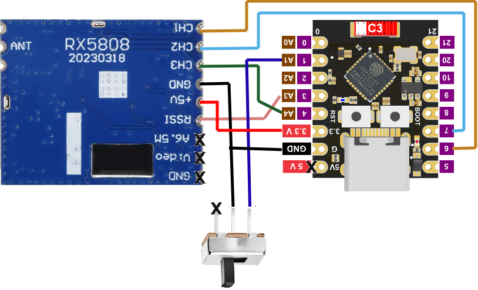

# Tracer Documentation

## Hardware Setup For RX5808 Version

### Required Components
- ESP32-C3 SuperMini development board
- RX5808 FPV receiver module
- Mode selection switch (GND=Node mode, 3.3V=WiFi mode)
- Basic wiring supplies

### Pin Connections (ESP32-C3 SuperMini - Hertz-hunter Compatible)

```
ESP32-C3 Pin | RX5808 Pin   | Description   
-------------|--------------|------------------------------
GPIO 3       | RSSI         | RSSI analog input (ADC1_CH3)
GPIO 6       | DATA CH1     | SPI data line (MOSI)
GPIO 4       | CLK CH3      | SPI clock line
GPIO 7       | SEL CH2      | SPI chip select (LE pin)
3.3V         | VCC          | Power supply
GND          | GND          | Ground
```


### Mode Switch (Optional)
```
ESP32-C3 Pin | Switch       | Description
-------------|--------------|-------------
GPIO 1       | Common       | Mode selection
Nothing      | Default      | RotorHazard node mode (floating)
GND          | Position 1   | RotorHazard node mode
3.3V         | Position 2   | WiFi standalone mode
```

<a href="tracer-rx5808-ver.png"></a>

**Important**: 
- **Nothing connected** (floating) = RotorHazard node mode (default)
- **GND connected** = RotorHazard node mode  
- **3.3V connected** = WiFi standalone mode


## PCB Design Considerations

### Layout Guidelines
- Keep RSSI input traces short and shielded
- Use ground plane for noise reduction
- Separate analog and digital sections
- Include proper decoupling capacitors

### Connector Options
- Standard 0.1" headers for ESP32 module
- JST connectors for RX5808 connection
- USB connector for power/programming

## Power Requirements
- Input voltage: 5V USB or 3.3V direct
- Current consumption (ESP32-C3):
  - WiFi mode: ~120mA
  - RotorHazard mode: ~60mA
- Use quality power supply for stable operation
- ESP32-C3 is more power efficient than original ESP32

## Web Interface Setup
The standalone mode requires web interface files to be uploaded to SPIFFS:
```bash
# After uploading firmware, also upload web files:
pio run -e esp32-c3-supermini --target uploadfs
```
Without this step, the web interface will show a blank page.

## Mechanical Considerations
- Enclosure should allow WiFi signal in standalone mode
- Status LED should be visible
- Mode switch should be accessible
- Mounting points for race gate installation
